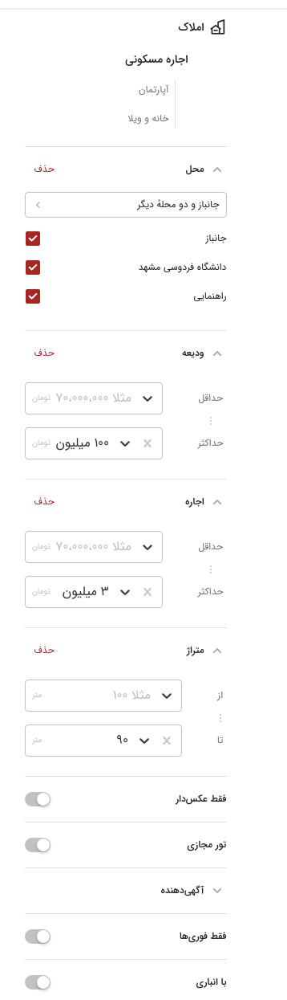
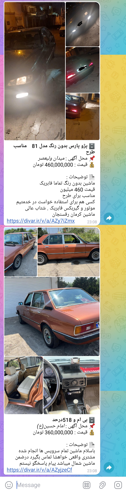

# Divar Telegram Bot

1. Clone the repository:

    ``` shell
    git clone https://github.com/debMan/divar-telegram-bot.git 
    cd divar-telegram-bot
    cp .env.sample .env
    echo '[]' > tokens.json
    # on Mac
    gsed -ri 's|PATH_TO_YOUR_DIR|'"$PWD"'|g' docker-compose.yml 
    # on GNU/Linux
    # sed -ri 's|PATH_TO_YOUR_DIR|'"$PWD"'|g' docker-compose.yml 
    ```

2. Open `@BotFather` in Telegram.
3. Create a new bot, and place ist token (Or use an existing bot token) into the `.env` file.

    ``` shell
    BOT_TOKEN = '<BOT-TOKEN-HERE>'
    ```

4. Send a message to `@getidsbot` and the response should be something like this:
Copy the `id` and paste it to `.env` file:

    ``` shell
    BOT_CHATID = '<CHAT-ID-HERE>'
    ```

5. Open your new (or old) bot (from step 2) and press `Start` (So the bot can send you messages).

6. Go to https://divar.ir/, select your city and go to the desired category. Choose some search conditions like this:

    

    The web browser's URL should be something like this:

    ```url
    https://divar.ir/s/mashhad/rent-residential/janbaz?districts=1124%2C442&credit=-100000000&rent=-3000000&size=-90
    ```

    Copy everything after `https://divar.ir/s/`, in this case, it will be `mashhad/rent-residential/janbaz?districts=1124%2C442&credit=-100000000&rent=-3000000&size=-90`

    So, paste this as `SEARCH_CONDITIONS` in the `.env` file:

    ``` shell
    SEARCH_CONDITIONS = "mashhad/rent-residential/janbaz?districts=1124%2C442&credit=-100000000&rent=-3000000&size=-90"
    ```

7. Tune other parameters on `.env` file with your desired spec

8. Run the service:

    ``` shell
    docker compose up --build -d
    ```

## Final Result


